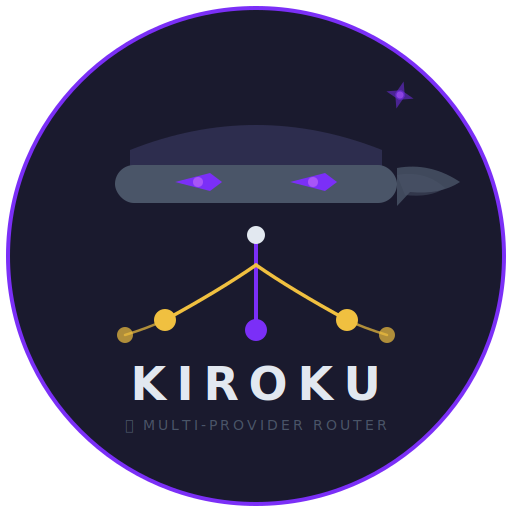

<div align="center">



# Kiroku

**Multi-Account Router for Kiro CLI**

*Quota habis di tengah coding? Kiroku auto-switch ke akun lain. Zero downtime.*

[]()
[]()

</div>

---

## The Problem

Kiro CLI punya quota limit per akun. Kalau kamu coding intensif:

- ❌ **1000 credits habis dalam 1 hari** — session terputus
- ❌ **Manual switch akun** — ribet, break flow, context hilang
- ❌ **Gak tau sisa quota** — tiba-tiba limit di tengah task penting
- ❌ **Satu akun gak cukup** — apalagi kalau full-time pakai AI

Sound familiar?

## The Solution

Kiroku = **Kiro** + **路** (roku — jalan/path). Satu command, banyak akun, zero downtime.

```
$ kiroku chat
┌──────────────────────────────────────┐
│ 🥷 Kiroku v0.1.0                     │
│ Pool: 12 akun aktif                  │
│ Current: akun-7 (sisa 420 credits)   │
│ Watcher: ✅ monitoring               │
│ Next: auto-switch jika < threshold   │
└──────────────────────────────────────┘
```

Kiroku wraps Kiro CLI. Semua fitur Kiro CLI tetap jalan — plus superpowers:

## Features

| Feature | Deskripsi |
|---------|-----------|
| 🔄 **Auto-Rotation** | Quota habis? Otomatis pindah ke akun berikutnya. Tanpa jeda. |
| 🏊 **Account Pool** | Unlimited akun dalam satu pool. Set once, forget. |
| 👁️ **Quota Watcher** | Background monitor — switch *sebelum* limit, bukan sesudah. |
| 📊 **Dashboard** | Real-time usage per akun, per session. Tau persis berapa sisa. |
| ⚡ **Drop-in** | `kiroku chat` = `kiro-cli chat` + multi-account. Zero learning curve. |
| 🖥️ **Cross-platform** | Windows x64, macOS (Intel + Apple Silicon), Linux (x64 + ARM64) |

## How Many Accounts Do You Need?

| Akun | Total Credits | Estimasi |
|------|---------------|----------|
| 1 | 1000 | ~1 minggu coding ringan |
| 3 | 3000 | ~2-3 minggu normal |
| 5 | 5000 | ~1 bulan full-time |
| 10 | 10000 | Unlimited praktis |

> Coding nonstop 24 jam bisa habiskan 1 akun. Dengan Kiroku, tinggal stack akun — auto-rotate handle sisanya.

## Quick Start

**Windows (PowerShell 7):**

```powershell
irm 'https://raw.githubusercontent.com/andyvandaric/kiroku/main/install.ps1' | iex
```

**Linux / macOS:**

```bash
curl -fsSL https://raw.githubusercontent.com/andyvandaric/kiroku/main/install.sh | bash
```

Installer otomatis:
- ✅ Install Kiro CLI (jika belum ada)
- ✅ Download + verify binary (SHA-256)
- ✅ Setup PATH
- ✅ Install WezTerm (Windows, recommended terminal)

## After Install

```bash
# Login akun (ulangi untuk setiap akun tambahan)
kiroku login

# Lihat pool
kiroku account list

# Mulai coding — auto-rotation aktif
kiroku chat
```

## Requirements

- **Kiro CLI** account (free tier works, Pro recommended)
- **Kiroku access** (private distribution — installer will guide you)
- **Windows:** PowerShell 7+ & WezTerm (auto-installed)
- **macOS/Linux:** Any modern terminal

## Why "Kiroku"?

> 🥷 **Kiro** + **路** (roku) = "Ninja Path"
>
> Seperti ninja yang punya banyak jalur escape — Kiroku routing kamu ke akun yang masih punya quota. Gak pernah stuck.

---

<div align="center">

**by [Andyvandaric](https://github.com/andyvandaric)**

</div>
